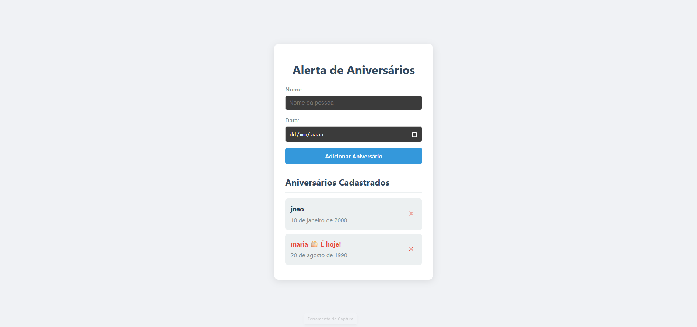

# Alerta de Aniversários

## Detalhe do projeto



Este é um aplicativo simples para gerenciar e ser lembrado de datas de aniversário. A aplicação permite adicionar, remover e visualizar aniversários, com um alerta especial para as datas que caem no dia atual.

## Tecnologias

- **React**: Biblioteca JavaScript para a construção da interface de usuário.
- **Vite**: Ferramenta de build otimizada para um ambiente de desenvolvimento rápido.
- **TypeScript**: Adiciona tipagem estática ao JavaScript para maior segurança e escalabilidade.
- **Local Storage**: Utilizado para persistir os dados dos aniversários diretamente no navegador do usuário, garantindo que as informações não sejam perdidas ao fechar a página.

## Funcionalidades

- **Adicionar Aniversário**: Um formulário intuitivo para cadastrar o nome e a data de pessoas queridas.
- **Remover Aniversário**: Possibilidade de remover qualquer aniversário da lista com um único clique.
- **Alerta do Dia**: O aplicativo exibe uma mensagem de destaque (`🎂 É hoje!`) ao lado do nome das pessoas que fazem aniversário no dia.
- **Persistência de Dados**: Todos os aniversários são salvos no `Local Storage` do navegador, mantendo a lista intacta mesmo após recarregar a página.

## Como Executar o Projeto

Para rodar a aplicação localmente, siga os passos abaixo no seu terminal:

1. **Instale as dependências:**

    ```bash
    npm install
    ```

2. **Inicie o servidor de desenvolvimento:**

    ```bash
    npm run dev
    ```

A aplicação estará disponível em `http://localhost:5173/`.

---

### Estrutura do Projeto

O código principal está localizado no arquivo `src/App.tsx`. A lógica de estado, o gerenciamento de dados no `Local Storage` e a verificação da data atual estão todos contidos neste componente.

A lógica de estilização está no arquivo `src/App.css`, que define a aparência da aplicação.

---

### Funcionalidades Futuras

O projeto pode ser expandido com as seguintes funcionalidades para se tornar ainda mais robusto:

1. **Notificações**: Implementar notificações no navegador para alertar o usuário sobre os aniversários do dia, mesmo que a página não esteja aberta.
2. **Ordenar por Data**: Adicionar a opção de ordenar a lista de aniversários por data, facilitando a visualização dos próximos a acontecer.
3. **Temas**: Adicionar um seletor de tema (claro/escuro) para personalizar a interface.

---

Com esta documentação, seu projeto está completo e pronto para ser exibido. Ele demonstra um excelente domínio do React, do gerenciamento de estado e da persistência de dados.

O que você achou da documentação? Podemos considerar este projeto finalizado?
